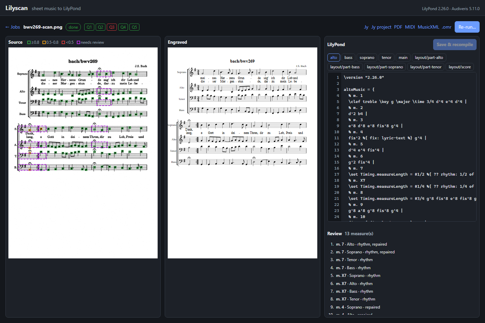
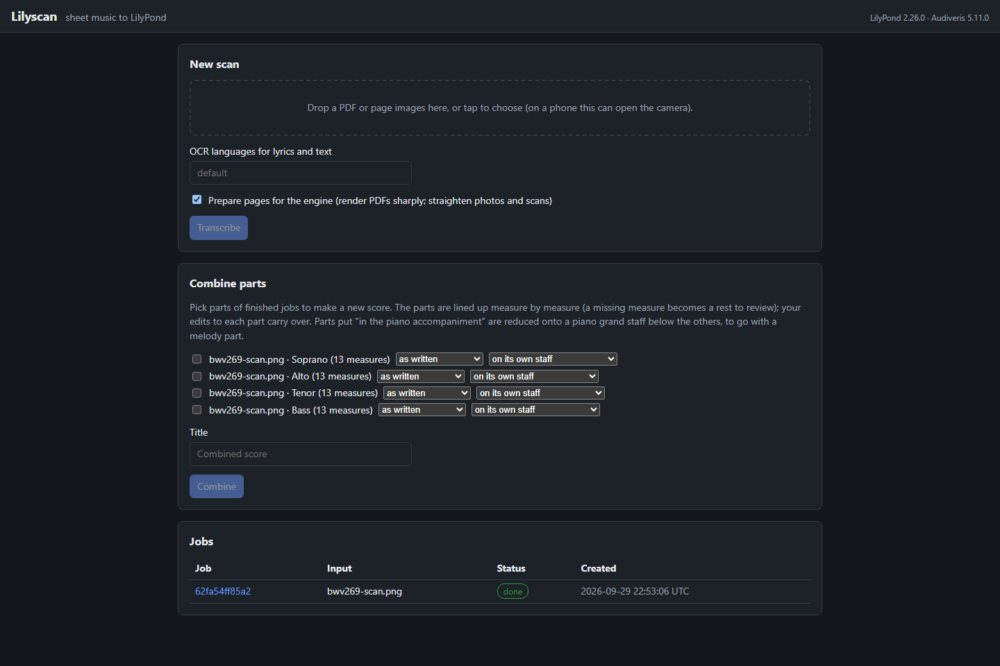
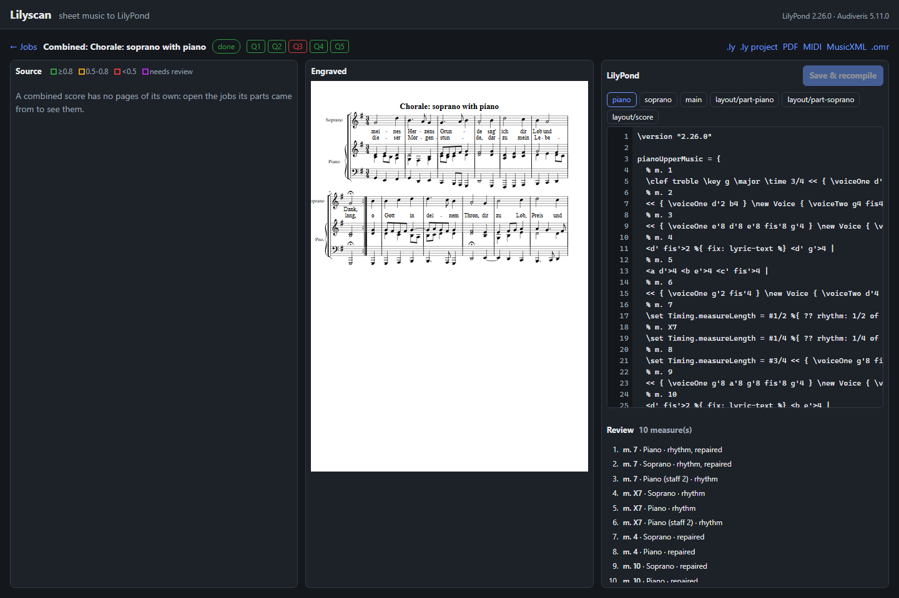

# Lilyscan

Sheet music in, editable LilyPond out. Lilyscan takes a born-digital PDF, a scan, or a phone
photo of printed music, reads it with the [Audiveris](https://github.com/Audiveris/audiveris)
optical music recognition (OMR) engine, repairs what the engine commonly gets wrong, and
writes a clean LilyPond project with the full score and every part. A browser UI shows the
page, the engraved result and the source side by side, so the measures that need a human
look can be found, fixed and recompiled in a minute.



**Status:** working end to end on one machine, in daily use on a library of real scanned
string parts. On the evaluation corpora about 83% of measures come out exactly right before
any human review (born-digital PDFs 89-92%, PNGs 83-88%, scans 83%, phone photos 72-74%);
see `eval/results/` and the status log in [docs/design.md](docs/design.md). What Audiveris
misreads is reported and fixed upstream where possible (see
[docs/upstream/audiveris](docs/upstream/audiveris/README.md)).

## What it does

- **Reads any kind of page.** Born-digital PDFs are rendered sharply at 400 DPI, and their
  printed tuplet numbers are used to check the rhythm. Photos and scans are straightened
  first: the page is found and seen head-on, uneven light is evened out, sideways or
  upside-down pages are turned upright, and curled or skewed staff lines are made straight.
  A scan is also read as uploaded, and Lilyscan keeps whichever result it expects to be
  better.
- **Repairs the engine's common mistakes** and says so: parts split between systems,
  key signatures misread on one system or in one part, tenor clefs read without their 8,
  missed triplets, dots and rests, multi-measure rests, page text or chord names read as
  lyrics, syllables read as one word. Each fix is listed in the review and noted in the
  source as a `% fix:` comment.
- **Tells you where to look.** Every note gets a calibrated confidence (a note at 0.7 is
  right about 70% of the time). Notes below 0.5 are marked in the source as `%{ ?? %}`, and a
  review list ranks the measures by what is wrong with them.
- **Writes real LilyPond.** One variable per staff, one line per measure with a bar check
  and a `% m. N` comment, absolute pitches, and layouts for the score and each part. The
  `.ly` download is a single file that engraves the score and each part.
- **Combines parts** read separately (a violin part and a cello part scanned on their own)
  into one score, lined up measure by measure, with transposition and concert pitch for
  transposing instruments. Parts can also be **reduced onto a piano accompaniment** below a
  melody part.
- **Exports** PDF, MIDI, MusicXML (for other notation programs) and the Audiveris project.

## How it works

A job goes through these stages (the design, and why each exists, is in
[docs/design.md](docs/design.md)):

| Stage | What happens | Code |
|---|---|---|
| 0. Ingest | Every page of every upload, in order, becomes one book for the engine | `lilyscan/ingest/` |
| 1. Prepare | Photos and scans are found, straightened, turned upright and cleaned | `lilyscan/prepare/` |
| 2. Engine | Audiveris 5.11.0 transcribes the book (batch mode; a failed page is left out and the rest read again) | `lilyscan/engine/audiveris/runner.py` |
| 3. Import | The exported MusicXML becomes Lilyscan's score model, with page positions and grades from the Audiveris project | `lilyscan/ir/musicxml.py`, `lilyscan/engine/audiveris/omr.py` |
| 4. Vector oracle | Born-digital PDFs: glyphs read from the PDF itself check tuplets | `lilyscan/vector/` |
| 5. Repair | Rule-based repairs, then Lilyscan's calibrated confidence | `lilyscan/repair/` |
| 6. Score model | Parts, staves, measures, voices, events, with provenance for every change | `lilyscan/ir/models.py` |
| 7. LilyPond | The editable project, compiled to PDF, MIDI and SVG | `lilyscan/lilypond/` |
| 8. Checks | Compiles (Q1), bar checks (Q2), measure durations (Q3), ranges (Q4), parts line up (Q5) | `lilyscan/qa/` |

Combining parts (`lilyscan/combine.py`) aligns the parts measure by measure
(`lilyscan/align.py`), lets parts that disagree on the key vote, optionally reduces some of
them to a piano accompaniment (`lilyscan/arrange.py`), and produces a new job.

## Project layout

```
lilyscan/            the library: pipeline stages (above), CLI (cli.py), evaluation
  evaluation/        corpus scoring (harness.py, compare.py) and confidence fitting
  synth/             the generated evaluation corpus (music, engraving, scan and photo simulation)
  runtime/           pinned tool versions, settings from the environment, compute device
services/
  lilyscan_app/      FastAPI app (api.py), job store (SQLite), job steps (tasks.py), dispatch
  web/               the browser UI (plain HTML, CSS and JavaScript, no build step)
  api/, worker/, audiveris-worker/   Dockerfiles for the homelab deployment
eval/                corpus specs (seed.json, repertoire.json) and committed results
docs/                design.md (design and status log), upstream/audiveris (bug reports and fixes)
tests/               pytest suite
scripts/             maintenance scripts (engine smoke test, .omr fixtures)
docker-compose.yml   the homelab deployment
```

## Install

Lilyscan runs on Windows and Linux (macOS should work, but is untested). You need:

| Tool | Version | Notes |
|---|---|---|
| Python | 3.12 | managed by [uv](https://docs.astral.sh/uv/) |
| [LilyPond](https://lilypond.org/download.html) | 2.26.0 | `lilypond` on the `PATH`, or `LILYPOND_BIN` |
| [Audiveris](https://github.com/Audiveris/audiveris/releases/tag/5.11.0) | 5.11.0 | the installer bundles its Java runtime; point `AUDIVERIS_BIN` at its executable (found automatically in `C:\Program Files\Audiveris` on Windows) |
| Tesseract language models | [tessdata](https://github.com/tesseract-ocr/tessdata) (not `tessdata_fast`) | `eng`, `lat`, `deu` and `fra` by default, in `%LOCALAPPDATA%\lilyscan\tessdata` on Windows (found automatically) or any folder named by `TESSDATA_PREFIX`. Without them Audiveris reads no lyrics or titles |

Audiveris needs the full models with the legacy engine: `tessdata_fast` and distribution
`tesseract-ocr-*` packages do not work. The versions are pinned: Lilyscan is tested against
exactly these (`lilyscan/runtime/config.py`).

Then:

```bash
git clone https://github.com/vilpter/lilyscan.git
cd lilyscan
uv sync --all-extras
uv run lilyscan versions
uv run lilyscan selftest
```

`versions` compares the installed LilyPond and Audiveris with the pinned ones; `selftest`
compiles a small score. For the homelab (Docker) deployment you need none of this, only
Docker (below).

## Start

On one machine, with jobs run inside the server process (no Redis or Docker):

```bash
uv run lilyscan serve
```

Then open <http://localhost:8000/>. `--port` changes the port and `--data` the folder where
jobs are kept (default `./data`).

In the homelab, with the published images (the API on port 8000, the Audiveris engine and the
pipeline in their own workers, and a Redis-compatible queue):

```bash
docker compose pull
docker compose up -d
```

Build locally with `docker compose up -d --build`, pin a build with `LILYSCAN_TAG=sha-<commit>`,
and change the port with `LILYSCAN_PORT`. With an NVIDIA GPU and the NVIDIA Container Toolkit:
`docker compose --profile gpu up -d --scale worker=0`. The services:

- `api`: FastAPI, the web UI and the job API (`/api/jobs`).
- `worker`: the pipeline (LilyPond, OpenCV, ONNX Runtime); `worker-cuda` under the `gpu` profile.
- `audiveris`: Audiveris 5.11.0 behind a worker on the `engine` queue. Its JVM heap is capped by
  `AUDIVERIS_MAX_HEAP` (default `3G`).
- `redis`: the job queue, served by Valkey (BSD-3, Redis-protocol compatible).

## Use

### Transcribe



1. **Upload** a PDF or page images on the home page (on a phone this can open the camera).
   Pages are prepared for the engine unless you untick the option. The OCR languages for
   lyrics and text can be changed per upload.
2. **Follow** the job: preparing pages, the engine (about a minute a page), repairs, LilyPond
   and checks. A page Audiveris cannot read is left out, and the job's report says which.
3. **Review** in three panes. **Source** shows the page as the engine read it, every note
   boxed green, amber or red by confidence and the measures that need attention outlined.
   **Engraved** shows the LilyPond output. **LilyPond** is the editable source, with the
   review list of measures ranked by problems. Clicking a measure in any pane, or putting the
   caret on its line, highlights it in the other two. The badges Q1-Q5 show the checks.
4. **Edit** the source and press **Save & recompile**.
5. **Download** the result:
   - `.ly`: one file that engraves the score and each part. Compiling `piece.ly` gives
     `piece-score.pdf` and one PDF per part.
   - `.ly project`: the editable project (a file per part), as a zip.
   - PDF and MIDI of the score.
   - MusicXML: the score as transcribed and repaired, for other notation programs. Edits to
     the LilyPond source are not in it.
   - `.omr`: the Audiveris project, to open in the Audiveris application.

**Re-run** repeats a job with other settings (OCR languages, page straightening).

### Combine parts



**Combine parts** on the home page makes a new score from parts of finished jobs: say a
violin part and a cello part scanned separately.

- Each part can be transposed, or taken at concert pitch if it is a transposing instrument.
- Parts read separately seldom have exactly the same measures (the engine misses or adds one
  now and then), so they are lined up measure by measure. Where a part has no measure it gets
  a rest that shows in the review list. Parts that disagree on the key signature (one read
  wrongly throughout) take the key the others read.
- Your edits to each part carry over: the new score includes the parts' own LilyPond sources,
  and transposition is done by LilyPond's `\transpose`, so those sources stay as written.
- A part can go **in the piano accompaniment** instead of on its own staff. The chosen parts
  are reduced onto a piano grand staff below the others, turning an ensemble arrangement into
  a melody with piano. Each part goes to the staff for the register it sounds in (a double
  bass an octave below where it is written). Parts playing the same rhythm merge into chords;
  others keep voices of their own.

The combined score is a job like any other: review it, edit it, download it.

### Command line

```bash
uv run lilyscan convert score.mxl --out out/score
```

`convert` turns a MusicXML file (for example Audiveris output) into a LilyPond project with a
QA report. The other commands: `serve` (above), `versions`, `selftest`, `device` (the compute
device used), `corpus` and `eval` (below). `uv run lilyscan <command> --help` shows the options.

### What a job keeps

A finished job's folder (under `data/jobs/<id>/`) holds:

- `prepared/`: `pages.tif` (every page as given to the engine, in upload order), `uploaded.tif`
  when some page is a scan, and `report.json` (what was done to each page, quality warnings).
- `engine/`: the Audiveris project, its MusicXML and log, and `run.json` (the command, which
  pages were left out and why, and which reading was kept).
- `ir/score.json`: the score model, with page boxes and confidence per event.
- `ly/`: the LilyPond project (`main.ly`, `parts/`, `layout/`) and the compiled PDF and MIDI.
- `score.musicxml`, `overlays/page-N.png` (each page with the notes boxed by confidence), and
  `report.json` (pages, engine run, geometry, repairs, checks Q1-Q5).

### Configuration

Settings come from the environment:

| Variable | Default | Meaning |
|---|---|---|
| `LILYSCAN_DATA_DIR` | `data` | where jobs are kept (`serve --data` sets it) |
| `LILYSCAN_OCR_LANGUAGES` | `eng+lat+deu+fra` | Tesseract codes for lyrics and text; the Docker engine downloads missing models at startup |
| `LILYPOND_BIN`, `AUDIVERIS_BIN` | `lilypond`, `audiveris` | the tools' executables |
| `TESSDATA_PREFIX` | | the folder with the Tesseract models |
| `AUDIVERIS_TIMEOUT_S`, `AUDIVERIS_TIMEOUT_PER_PAGE_S` | 900, 240 | an engine run may take the larger of the two (the second per page) |
| `AUDIVERIS_STEP_TIMEOUT_S` | 300 | one engine step on one page (Audiveris's own default is 120) |
| `LILYPOND_TIMEOUT_S` | 120 | one LilyPond compile |
| `LILYSCAN_DISPATCH` | `rq` | `rq` (Redis workers) or `inline` (in the server process; `serve` sets it) |

## Develop

```bash
uv sync --all-extras
uv run pytest -m "not gpu and not engine"
uv run ruff check . && uv run ruff format --check . && uv run mypy lilyscan services
```

Tests marked `lilypond` need LilyPond, `engine` tests need Audiveris (`AUDIVERIS_BIN` and
`TESSDATA_PREFIX`), and `gpu` tests need a CUDA device. Missing tools cause a skip, not a
failure. Each change goes on a branch and a pull request; CI runs the tests, the images and a
LilyPond-next check. Changing a pinned tool version is a change of its own: update
`lilyscan/runtime/config.py` and the Dockerfiles, then re-run the evaluation.

### Evaluation

Two corpora measure every change against ground truth. The seed corpus is generated from
`eval/corpus/seed.json`: random but valid music with exact MusicXML, engraved with LilyPond,
then degraded to simulated scans and photos. The repertoire corpus holds excerpts of
public-domain works from music21's bundled corpus (`eval/corpus/repertoire.json`), fetched
from the installed package, with each work's rights recorded in the manifest.

```bash
uv run lilyscan corpus build
uv run lilyscan corpus build --spec eval/corpus/repertoire.json --out eval/corpus/repertoire
```

```bash
uv run lilyscan eval run --repair --prepare --label my-run
uv run lilyscan eval run --corpus eval/corpus/repertoire --repair --prepare --label my-run-rep
```

Results go to `eval/results/<label>/` (`summary.md`, `results.json`), and Audiveris's output is
cached in `eval/work/`, so later runs only re-score. The summary reports exact-measure
accuracy, edit rate, note F1, lyric and chord accuracy, how many engine events were located
on the page, and how well confidence is calibrated.

- `--repair` applies Lilyscan's repairs and confidence before scoring, and lists every repair.
- `--prepare` sends scans and photos through Stage 1 first, as a job does.
- `--lilypond` also generates LilyPond and reports how often it compiles (Q1) and passes bar
  checks (Q2).
- New engine runs need Audiveris and its OCR models (`AUDIVERIS_BIN`, `TESSDATA_PREFIX`).

After changing a repair rule or adding corpus pieces, refit the confidence model (it rewrites
`lilyscan/repair/confidence.json` and prints the calibration error per corpus):

```bash
uv run lilyscan eval calibrate
```

## License

AGPL-3.0-or-later, like Audiveris. See [LICENSE](LICENSE). Every model, dataset and library
Lilyscan uses must be AGPL-compatible ([docs/design.md](docs/design.md), decision D12).
